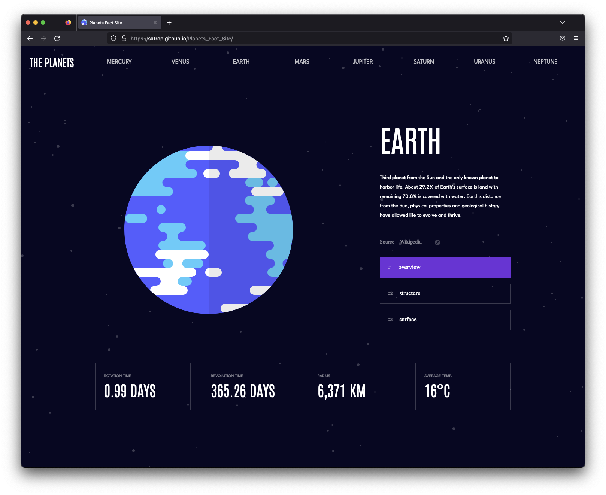

# [Frontend Mentor - Planets fact site](https://www.frontendmentor.io/challenges/planets-fact-site-gazqN8w_f)

## Overview

### The challenge

Your challenge is to build out this 8-page planets fact site and get it looking as close to the design as possible.

You can use any tools you like to help you complete the challenge. So if you've got something you'd like to practice, feel free to give it a go.

If you choose to use a JS-heavy approach, we provide a local data.json file for the planets. This means you'll be able to pull the data from there instead of using the separate .html files.

Your users should be able to:

View the optimal layout for the app depending on their device's screen size
See hover states for all interactive elements on the page
View each planet page and toggle between the "Overview", "Internal Structure", and "Surface Geology" tabs

### Screenshot



### Links

- [GitHub](https://github.com/satrop/Planets_Fact_Site/tree/main)
- [Live Site](https://satrop.github.io/Planets_Fact_Site/)

## My process

### Built with ❤️

- Semantic HTML5 markup
- SCSS with custom properties
- Flexbox
- CSS Grid
- Mobile-first workflow
- [React](https://reactjs.org/) - JS library

### What I learned

Woo-we! This was a steep learning curve.

#### React Router

Learning how to set up links, learning how to change the URL

```js
<ul className={isActive ? 'active' : ''}>
  <li>
  	<Link
  		onClick={ToggleClass}
  		className="mercury"
  		to="Planets_Fact_Site/mercury">
  		Mercury
  	</Link>
  </li>
  <li>
  	<Link
  		onClick={ToggleClass}
  		className="venus"
  		to="Planets_Fact_Site/venus">
  		Venus
  	</Link>
  </li>
  ...
```

### Active Classes, Maps &amp; Callback Functions Oh My!

Getting the overview, structure and surface buttons to pull in teh right data wasn't too hard but getting the class name to be active on the selected button gave me a run for my money and I did have to get a helping hand in a Scrimba Discord. HUGE thanks to @Mist on the Scrimba Discord for literally walking me over the finishing line for this!

It was a HARD learning curve getting this working and it was a good lesson in needing to slow down and breaking apart each part of the problem.

```js
const buttonClick = (event) => {
	setButtonData((prevButtons) => {
		return prevButtons.map((button) => {
			if (button.id == event.target.id) {
				return { ...button, isHeld: true };
			} else return { ...button, isHeld: false };
		});
	});

	if (event.target.id == 1) {
		setDisplayText(props.overview.content);
		setDisplayImage(props.images.planet);
		removeClassActive();
	} else if (event.target.id == 2) {
		setDisplayText(props.structure.content);
		setDisplayImage(props.images.internal);
		removeClassActive();
	} else if (event.target.id == 3) {
		setDisplayText(props.geology.content);
		setDisplayImage(props.images.planet);
		addClassActive();
	}
};

const buttons = buttonData.map((button) => {
	return (
		<button
			id={button.id}
			key={button.id}
			className={button.isHeld ? 'active' : ' '}
			onClick={buttonClick}>
			<span className="num">{button.number}</span>
			{button.text}
		</button>
	);
});
```

### Publishing React With Router DOM To GitHub

Not as easy as just pushing an actual one page React router app but with some research and some trial and error making sure I had the 404 page in the correct folder all was good. GH-pages don't play too well with React Router.

[How to get React Router Working With GH-Pages](https://github.com/rafgraph/spa-github-pages)
